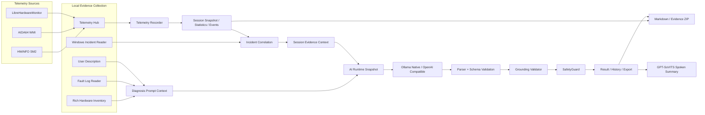

<div align="center">


# AIGeekTuner

**面向 Windows 的 AI 硬件监控、故障取证与结构化诊断工具**

把静态硬件清单、实时遥测、Windows 事件、故障日志与 AI 推理串成一条可验证的诊断链：  
**真实采集 → 证据归一 → 事件关联 → AI 分析 → Grounding 校验 → SafetyGuard → 报告 / 证据包**

[](https://github.com/nanfeilaotou/ai_geek_tuner)
[](https://dotnet.microsoft.com/)
[](https://learn.microsoft.com/dotnet/desktop/wpf/)
[](https://www.microsoft.com/windows/)
[](#tests--quality-gates)
[](#tests--quality-gates)
[](https://github.com/nanfeilaotou/ai_geek_tuner/stargazers)
[](https://github.com/nanfeilaotou/ai_geek_tuner/releases)
[](https://github.com/nanfeilaotou/ai_geek_tuner/commits)

**Tech Stack**

`C#` · `.NET 8` · `WPF` · `WMI` · `DXGI` · `CoreAudio` · `HWiNFO Shared Memory` · `AIDA64 WMI` · `LibreHardwareMonitor` · `OpenAI-Compatible API` · `Ollama` · `GPT-SoVITS`

</div>

---

AIGeekTuner v2.0 不再只是“把一份日志交给大模型总结”。它同时维护 **硬件静态事实、实时传感器数据、Windows 事件证据、录制会话统计、用户故障描述与原始日志**，并在 AI 输出后继续执行确定性的证据校验和安全复核。目标不是替代专业维修，而是把 Windows 电脑故障排查里分散的采集、归因、记录和报告整理成一个可以复现、可以审计、可以导出的工作流。

## Highlights

- **Rich Hardware Inventory**：一次性采集 CPU、主板、BIOS、内存条、GPU、显示器、磁盘/卷、声卡、网卡、操作系统等静态信息；GPU VRAM、显示器 EDID/GDI、磁盘容量与设备信息统一呈现。
- **Multi-source Telemetry Hub**：统一 HWiNFO、AIDA64、LibreHardwareMonitor 三类来源，按固定优先级选取单一可信来源，并保留 provenance，不做来源间“平均值”。
- **Live Hardware View**：CPU / GPU / 内存 / 磁盘等关键指标实时刷新，温度和利用率使用仪表条展示，同时跟踪会话内低值/高值；支持 DIMM 温度等多设备指标。
- **Diagnostic Recorder**：手动录制统一遥测快照，停止后生成 Min / Avg / Max / P50 / P95 / P99、覆盖率、关键变化事件与来源切换记录。
- **Windows Incident Evidence**：采集 Kernel-Power、WHEA、Display/TDR、磁盘、应用崩溃/卡死、WER 等 Windows 事件，并与遥测 Session 做时间关联；关联结果只表示相关性，不直接当作因果。
- **Evidence-grounded AI Diagnosis**：模型生成的 `Fact` 必须绑定本次请求中的 `sourceId` 与逐字符 `sourceQuote`；引用不存在、引用上一轮请求或擅自改写用户原话都会被拒绝。
- **Provider-neutral AI Runtime**：支持 Ollama Native、LM Studio、llama.cpp、DeepSeek 以及标准 OpenAI-Compatible 服务；全局 Provider / 默认模型只在 Settings 维护，请求启动时捕获不可变 runtime snapshot。
- **Structured Output + One Repair**：强类型 JSON 结果、枚举/范围校验、Grounding 校验；结构或 grounding 失败最多自动修复一次，第二次仍失败则 fail closed。
- **Local SafetyGuard**：在 AI 结果展示前继续检查危险电压建议、关闭保护机制、绕过安全限制、低置信度绝对化措辞等风险。
- **Session AI + GPT-SoVITS**：录制会话可生成结构化 AI 分析与 Spoken Summary，并通过 GPT-SoVITS 生成可缓存的语音结果。
- **Portable Exports**：Session 可导出 Markdown 报告与 Evidence ZIP；Application Settings v2 与 AI Provider v1 可独立导入/导出，凭据永不进入备份文件。
- **Windows-native Shell**：一体化自定义标题栏、圆角、任务栏工作区最大化、固定 Normal 尺寸、原生最小化/还原动画、全窗口背景拖动与正常 client-area 滚轮输入。
- **Encoding & Long-log Safety**：支持 UTF-8 / UTF-16 / GB18030；超长日志使用有界裁剪并显式标记截断，模型不能引用未实际进入 Prompt 的内容。

## Screenshots

> v2.0 截图可放在 `docs/screenshots/`。建议保留 4–6 张：Dashboard、Hardware Live、Recorder/Session、AI Diagnosis Result、Settings Provider、Evidence Export。

<!--
<p align="center">
  
  
</p>
<p align="center">
  
  
</p>
-->

## Feature Matrix

| 模块 | v2.0 能力 |
| --- | --- |
| Dashboard | 型号、Windows、运行时间秒级刷新；CPU / GPU / 内存 / 主板 / 显示器 / 磁盘 / 声卡 / 网卡摘要 |
| Hardware Inventory | CPU、Board、BIOS、DIMM、GPU、Monitor、Disk/Volume、Audio、Network、OS 等 Rich Inventory |
| Hardware Live | 温度、利用率、频率、功耗、多磁盘温度、DIMM 温度、来源状态、Low/High 跟踪 |
| Telemetry Hub | HWiNFO / AIDA64 / LibreHardwareMonitor 统一 canonical metrics、设备 reconciliation、provenance |
| Recorder | 1 / 2 / 5 秒采样，Session 本地持久化、统计、关键变化、来源切换、采样缺口 |
| Windows Incident | Kernel-Power、WHEA、Display/TDR、Disk、Application Crash/Hang、WER |
| AI Diagnosis | 用户描述 + 故障日志 + 硬件/系统上下文，结构化 Fact / Inference / Recommendation |
| Evidence Grounding | `sourceId` 白名单、`sourceQuote` Ordinal 子串校验、request identity、fail closed |
| AI Provider | Ollama Native + OpenAI-Compatible；LM Studio / llama.cpp / DeepSeek 等均可配置 |
| Session AI | Telemetry + Incident 统一证据上下文、evidence ID 校验、Structured Analysis |
| Voice | GPT-SoVITS API v2、Spoken Summary、WAV 缓存与重启恢复 |
| History / Reports | Diagnosis History、Session History、Markdown 报告、Evidence ZIP |
| Settings | Application Settings 自动保存；Provider 独立 Draft → Test → Save → Activate |
| Portability | Settings v2 / Provider v1 独立导入导出；API Key / DPAPI credential 永不导出 |
| Window Shell | Integrated WindowChrome、DWM 圆角、rcWork 最大化、原生任务栏语义、App Icon |

## Architecture



### 1. Rich Hardware Inventory

静态硬件清单与实时遥测分离。Dashboard / Hardware 页面使用 Windows 本机接口构建 Rich Inventory，不要求 HWiNFO 或 AIDA64 才能显示基础硬件信息。

采集覆盖：

- CPU 型号与基础规格
- 主板与 BIOS
- 物理内存模块：厂商、容量、频率、插槽、Part Number 等
- NVIDIA / AMD / Intel GPU，包含可获取的独立显存信息
- 显示器：EDID / GDI 信息、分辨率、刷新率、主屏标记
- 物理磁盘与卷
- CoreAudio / 声音控制器
- 有线 / 无线网络适配器
- Windows / 启动时间 / Uptime

启动阶段使用 single-flight Rich Inventory；不同采集类别可并行执行，Dashboard 不再先显示一套 legacy 结果再整体切换。

### 2. Multi-source Telemetry Hub

AIGeekTuner 将多个监控来源归一为统一 canonical telemetry domain。每个值不仅有数值，还保留设备身份、指标类型、单位、来源与时间。

| 来源 | 接入方式 | 定位 |
| --- | --- | --- |
| **HWiNFO** | Shared Memory / SM2 | 可选高优先级来源；需用户自行安装并启用 Shared Memory |
| **AIDA64** | `Root\WMI\AIDA64_SensorValues` | 可选来源；需启用 External Applications 数据导出 |
| **LibreHardwareMonitor** | 内置 | 默认 fallback，无需额外安装 |

同一指标按 **HWiNFO → AIDA64 → LibreHardwareMonitor** 选择单一来源，不进行来源间平均。跨 Provider 设备合并要求有足够身份依据；证据不足时保留来源本地身份，避免把两块不同设备错误融合。

LibreHardwareMonitor 的 CPU / GPU 枚举路径做了隔离，避免 Intel GCL/IntelGpuGroup 的高风险组合影响整个进程；Intel iGPU 缺少安全来源时宁可显示缺失，也不伪造值。

### 3. Live Hardware Presentation

Hardware 页面在 Rich Inventory 基础上叠加实时指标：

- CPU：温度、利用率、频率、功耗
- NVIDIA GPU：温度、利用率、核心/显存频率、功耗
- iGPU：可用时显示利用率与频率
- Memory：使用率、已用容量、运行频率、可用的 DIMM 温度
- Disk：按物理设备显示温度
- Provider 状态：HWiNFO / AIDA64 / LHM Ready / Unavailable / Needs Configuration

温度与利用率使用 meter 展示；当前会话的 Low / High 由 AIGeekTuner 自己跟踪，不依赖某个 Provider 的私有 min/max 字段。

## Diagnostic Recording & Incident Evidence

### Telemetry Recorder

Recorder 以统一 snapshot 为输入，不直接绑定某个厂商 Provider。用户开始录制后按固定周期采样，停止时生成确定性统计并落盘。

- 采样间隔：1 / 2（默认）/ 5 秒
- 统计：Min / Avg / Max / P50 / P95 / P99 / coverage
- 关键变化：温度跳变、利用率大幅变化、频率/功耗显著变化、CPU throttling、Provider 来源切换、采样缺口
- 多设备实例与来源 provenance 全程保留
- Session 原子持久化，不依赖 AI 才能成立

### Windows Incident Evidence

Windows 事件不是“AI 猜测”，而是另一条确定性证据来源。v2.0 会读取并归类：

- Kernel-Power / Unexpected Shutdown
- WHEA hardware error
- Display / TDR
- Disk / storage error
- Application Crash / Hang
- Windows Error Reporting

Incident 可与完成的遥测 Session 按时间窗口关联，但系统明确遵循 **correlation ≠ causation**：时间接近只能作为线索，不能自动证明“某个温度峰值导致了某个崩溃”。

## AI Diagnosis & Evidence Grounding

### Fact / Inference 分层

AIGeekTuner 不允许模型把“听起来像真的”直接当作事实。诊断输出将证据项分为：

- **Fact**：必须能绑定本次请求中的真实 source
- **Inference**：AI 基于事实给出的可能解释
- **Unknown / Low-confidence**：证据不足时明确保留不确定性
- **Recommendation**：下一步验证或安全处置建议

### Source-grounded Facts

每个新 Fact 都必须包含：

```json
{
  "sourceId": "source:fault-log",
  "sourceQuote": "Display driver nvlddmkm stopped responding and has successfully recovered."
}
```

Grounding Validator 会确定性检查：

1. `sourceId` 必须属于**本次请求**；
2. `sourceQuote` 不得为空；
3. `sourceQuote.Trim()` 必须是对应 source 内容中的 **Ordinal Unicode 子串**；
4. 不能引用上一轮请求、Knowledge Base 或模型自造 source；
5. UI 中“事实证据”优先显示校验后的原始 `sourceQuote`，不是模型自行改写的描述。

这意味着类似“用户输入：我电脑卡了 → 模型声称：用户说电池没电了”的错误不会再作为 Fact 通过。

### Structured Output & One Repair

AI 响应经过：

```text
Provider Response
    ↓
JSON Parser / Schema
    ↓
Grounding Validator
    ↓
SafetyGuard
    ↓
Result
```

如果 JSON 结构或 grounding 第一次失败，会使用**同一份 runtime snapshot**最多进行一次 repair。repair 仍然失败时，诊断 fail closed，不展示未经证据约束的 Fact。

HTTP、认证、超时、取消等传输失败不会被错误地当成“模型格式问题”重试。

### SafetyGuard

SafetyGuard 位于本机，和 AI Provider 无关。它负责对已经解析/grounded 的建议继续做确定性安全复核，例如：

- 异常高电压建议
- 禁用硬件保护机制
- 绕过安全限制
- 低置信度却使用绝对化诊断措辞
- 其它高风险操作建议

Grounding 解决“事实从哪里来”，SafetyGuard 解决“这个建议是否安全”，两者职责分离。

## Unified AI Provider Runtime

v2.0 将 AI 从旧的 Ollama-only 路径升级为统一 Provider Runtime。

支持：

- **Ollama Native**
- **LM Studio**
- **llama.cpp**
- **DeepSeek**
- 其它符合标准 `/chat/completions` 语义的 **OpenAI-Compatible** 服务

Provider Profile 包含 Display Name、Kind、Base URL、Models、Default Model、Structured Output Mode、Enabled 等非敏感配置。API Key 独立存放在 Windows DPAPI credential store 中，不进入 Provider JSON。

### Runtime Snapshot

每次 AI 请求开始时捕获不可变 `AiRuntimeSnapshot`：

```text
Provider
Model
Base URL
Structured Output Mode
Credential
Timeout
```

之后即使用户在 Settings 中切换 Provider，也只影响**下一次请求**；正在运行的 Diagnosis / Session Analysis 继续使用启动时的 snapshot，repair 也必须使用同一份 snapshot。

### Structured Output Modes

不同服务对 JSON/schema 的支持不同，因此 Provider 可配置相应模式：

- Native Schema
- OpenAI JSON Schema
- JSON Object
- Prompt Only

Ollama Native 与 OpenAI-Compatible transport 会根据协议能力映射，而不是在业务层硬编码某一家服务。

## Session AI & Voice

Session Analysis 将遥测统计、关键变化与 Windows Incident 组成证据上下文，AI 只能引用允许的 evidence ID，例如：

```text
stat:...
event:...
incident:...
```

分析结果在持久化后可生成 Spoken Summary。GPT-SoVITS 通过 API v2 接入，WAV 会按 Session 缓存，重启后仍可恢复播放状态。

语音层是 presentation 能力，不参与 Fact grounding，也不是 Evidence ZIP 的必要诊断证据。

## Export, Backup & Portability

### Session Export

Session Detail 支持两种输出：

**Markdown Report**

包含基本信息、硬件摘要、遥测统计、关键变化、Windows Incident、AI Analysis 与数据说明。

**Evidence ZIP**

包含已经持久化的确定性数据，例如：

```text
README.md
report.md
session.json
incidents.json    # 有则包含
analysis.json     # 有则包含
```

导出时不会重新采样、重新读取 Event Log 或重新调用 AI，因此导出结果与原 Session 保持一致。`voice.wav` 默认不放入证据包。

### Application Settings v2

Application Settings 使用独立的 versioned portable schema，可导出 / 导入：

- Diagnosis history behavior
- AI timeout
- Fault log input limit
- Recording interval
- Hardware refresh
- GPT-SoVITS / Voice 非敏感配置
- 其它当前应用偏好

普通 Settings 使用 auto-save：Toggle / Combo 等合法变更立即持久化；Text/Numeric 输入经过校验与短 debounce 后保存。Provider 配置不采用 auto-save。

### Provider Configuration v1

AI Provider 另行导出，不和 Application Settings 混为一个文件。导入采用非破坏 merge/update：

- 相同 Provider ID 更新非敏感字段
- 本机已有 credential 保留
- 新 Provider 可导入，但 credential 为空
- 本机独有 Provider 不会因为导入文件缺失而被删除
- 有效的 imported activeProviderId 可恢复 active Provider

导出文件始终：

```json
{
  "credentialsIncluded": false
}
```

**API Key 明文、DPAPI blob、`credentials.json` 永不导出。**

## Settings Model

Application Settings 与 AI Provider 采用不同产品语义：

| 区域 | 保存策略 |
| --- | --- |
| 常规开关 / 下拉 | 合法变更立即保存 |
| Text / Numeric | 校验通过后 debounce 保存，Enter / LostFocus 可立即提交 |
| AI Provider | Draft → Test Connection → Save Provider → Set Active |
| API Key | 独立 credential store，不出现在 portable export |

这样既避免了页面底部重复的“全局保存”语义，也避免用户在 Provider URL / Model 等组合配置尚未填写完整时污染当前 runtime。

## Windows Shell

v2.0 对默认 WPF 窗口壳进行了完整产品化处理：

- 一体化蓝色 WindowChrome，自定义 Minimize / Maximize / Close
- Windows 11 DWM rounded corners
- Normal 固定 1180×760 DIP；用户不自由拉伸
- 最大化使用当前显示器 `rcWork`，不会覆盖任务栏，也不硬编码任务栏高度
- Taskbar 点击最小化 / 还原遵循标准 Windows Shell 语义
- 原生 minimize / restore 动画保留
- 页面普通 client content 始终保留正常滚轮输入
- 普通 TextBlock / Card / Grid / Sidebar 空白可直接拖动窗口
- Button / TextBox / ComboBox / DataGrid / ScrollBar 等交互元素不会误触发窗口拖动
- 多显示器与 Windows DPI scaling 保持系统语义
- 最终 native style 由 WPF 单一维护，不再在 HWND 创建后手工修改 MINBOX / MAXBOX

## Reliability

v2.0 中专门修复和锁定了一批很容易在桌面硬件工具中出现的边界问题：

- Dashboard 冷启动使用单一 Rich Inventory，不再从 legacy 5-row 突然跳到另一套 8-row UI。
- Hardware Inventory 使用 single-flight，避免 Dashboard / Hardware 重复收集；类别采集可并行执行。
- LHM CPU / GPU 路径隔离，避免 Intel GCL native crash 风险污染整个应用。
- Diagnosis Request 带独立 RequestId；旧异步请求完成后不能抢占新页面或覆盖当前 Result。
- Session AI state 以 Session ownership 隔离，切换历史记录不会把其它 Session 的 AI/Voice 状态显示过来。
- 配置导入先完整解析和验证，再原子应用；失败不会形成“半导入”。
- Session / History / Settings 使用原子写入与备份策略处理损坏或中断。
- Startup Breadcrumb 与 Exception Log 用于定位启动/native 问题，但不会记录 Prompt、API Key 或用户私密诊断内容。

## Log Input & Long-context Behavior

支持：

- UTF-8
- UTF-16
- GB18030

大日志进入 AI 前有明确字符上限。当前 v2.0 对超长内容使用 bounded head/tail 策略并插入截断标记，因此：

- 模型知道原始日志被裁剪；
- Grounding 只允许引用实际进入 Prompt 的片段；
- 不会因为原文件包含某行，就允许 AI 引用已经被裁掉的中间内容。

未来可以加入本地 Error/Warning/EventID 预筛选，以提高超长日志中段异常的召回率；这不是 v2.0 的发布阻塞项。

## Privacy & Security

AIGeekTuner 把“本地采集”和“AI 推理”明确区分：

**始终在本机完成**

- Hardware Inventory
- Telemetry aggregation
- Windows Incident acquisition
- Log decoding / truncation
- Grounding validation
- SafetyGuard
- History / Session persistence
- Settings / credential storage
- Report / Evidence ZIP export

**取决于当前 Provider**

- AI inference
- repair request
- Session AI analysis

如果使用 Ollama、LM Studio、llama.cpp 等本地 Provider，AI 请求可以完全停留在本机；如果选择 DeepSeek 或其它云端 OpenAI-Compatible Provider，对应诊断上下文会发送到该 Provider。

API credential 使用 Windows DPAPI 存储，Provider export 不读取 credential store。

## Quick Start

### Requirements

- Windows 10 / 11
- .NET 8 Desktop Runtime（仅 framework-dependent 构建需要）
- 至少配置一个可用 AI Provider
- HWiNFO / AIDA64 均为可选，不影响基础硬件清单与内置 LHM fallback

### Clone & Run

```bash
git clone https://github.com/nanfeilaotou/ai_geek_tuner.git
cd ai_geek_tuner
dotnet restore
dotnet run --project AIGeekTuner/AIGeekTuner.csproj
```

### Local Ollama Example

```bash
ollama pull qwen3:8b
ollama serve
```

然后在 Settings → AI Provider 中选择 / 创建 Ollama Profile，保存并设为当前使用即可。

### Other Providers

LM Studio / llama.cpp 等本地服务可使用 OpenAI-Compatible Profile；云端兼容服务填写对应 Base URL、Model 与 API Key。Provider 页面支持独立测试连接、保存和激活。

## Data Sources

| 数据 | 默认 / 内置 | 可选外部来源 |
| --- | --- | --- |
| Static Hardware Inventory | Windows WMI / DXGI / GDI / CoreAudio / Network APIs | 无需外部工具 |
| Realtime Telemetry | LibreHardwareMonitor | HWiNFO / AIDA64 |
| Windows Incidents | Windows Event Log | 无 |
| Fault Logs | 用户导入 `.txt` / `.log` | 无 |
| AI | 用户选择 | Ollama / LM Studio / llama.cpp / DeepSeek / OpenAI-Compatible |
| Voice | 可选 | GPT-SoVITS API v2 |

> AIGeekTuner 不捆绑 HWiNFO 或 AIDA64，不自动下载，也不会自动修改这些工具的设置。

## Persistence

主要数据职责：

```text
Settings
├─ application settings
├─ provider catalog
└─ DPAPI credentials

History
└─ diagnosis records

Sessions/{id}
├─ session.json
├─ incidents.json
├─ analysis.json
└─ voice cache
```

具体路径由应用运行时存储层管理。公开文档不依赖用户机器上的绝对路径。

## Tests & Quality Gates

```bash
dotnet test
dotnet test -c Release
```

当前 v2.0 release-prep gate：

- **841 / 841 tests passed**
- **Debug: 0 warnings / 0 errors**
- **Release: 0 warnings / 0 errors**
- 11 组人工/合成 Diagnosis Acceptance 已通过，包括：
  - NVIDIA TDR
  - WHEA corrected PCIe error
  - NVMe I/O timeout
  - Application Hang / Crash
  - Memory pressure
  - Kernel-Power unknown cause
  - No-evidence subjective lag
  - Prompt injection inside log
  - Large-log truncation
  - Multi-signal timeline
  - GB18030 Chinese decoding

自动化覆盖包括 Parser、Prompt/source 构建、Grounding、SafetyGuard、Provider Runtime、runtime snapshot isolation、FileReader 编码、History、Session Analysis、Telemetry Hub、AIDA64/HWiNFO mapping、Recorder、Windows Incident、Settings portability、WindowChrome 与页面构造等。

## Project Structure

```text
AIGeekTuner/
├─ Commands/
├─ Configuration/
├─ Controls/
├─ Converters/
├─ KnowledgeBase/
├─ Models/
│  ├─ Hardware/
│  ├─ Incidents/
│  ├─ Sessions/
│  └─ Telemetry/
├─ Services/
│  ├─ AI/Providers/
│  ├─ Diagnosis/
│  ├─ Diagnostics/
│  ├─ Hardware/Inventory/
│  ├─ History/
│  ├─ Incidents/
│  ├─ Reports/
│  ├─ Safety/
│  ├─ SessionAnalysis/
│  ├─ Settings/
│  ├─ Telemetry/
│  └─ Voice/
├─ Themes/
├─ ViewModels/
└─ Views/
```

## Design Principles

1. **No fabricated hardware facts** — 采不到就明确缺失，不用模型补值。
2. **Evidence before inference** — 先保存真实 source，再允许 AI 推断。
3. **Correlation is not causation** — 遥测峰值和 Windows 事件时间接近不等于因果成立。
4. **Provider-neutral** — 业务逻辑不绑定 Ollama、DeepSeek 或某一家服务。
5. **Immutable in-flight runtime** — 设置修改不影响已经开始的请求。
6. **Local safety boundary** — Grounding / SafetyGuard / Persistence 不交给云端模型决定。
7. **Fail closed** — AI 输出结构/证据不合格时宁可失败，也不展示伪 Fact。
8. **Best-effort hardware acquisition** — 单个硬件类别或数据源失败不能拖垮整个应用。
9. **Portable without secrets** — 配置可以迁移，凭据不跟着导出。
10. **Windows-native UX where it matters** — Taskbar、DPI、工作区最大化、滚轮和窗口状态遵循 Windows 语义。

## Limitations

- AI 诊断是辅助分析，不替代专业硬件维修和厂商检测工具。
- WMI / 驱动 / BIOS / 传感器实现差异会导致部分设备字段不可读；AIGeekTuner 会显示缺失而不是伪造。
- HWiNFO / AIDA64 能力取决于用户自己的安装、授权与导出设置。
- 超长日志当前采用 bounded head/tail，而不是完整语义检索；中间异常可能因此未进入 AI 上下文。
- 不解析 Minidump 二进制文件。
- 不执行 BIOS、超频、电压、保护机制关闭等硬件写操作。
- 不保证所有 OpenAI-Compatible 服务都实现完全相同的 structured output 扩展；可使用 JSON Object / Prompt Only 等兼容模式。
- AI 仍可能做出错误推断；请结合 confidence、Fact / Inference 分区与原始证据判断。

## Roadmap

v2.0 当前主线已经封版。后续可能的方向包括：

- 超长日志本地 Error / Warning / EventID 预筛选
- 更完整的 Frame Timing / 游戏性能诊断
- Controlled Reproduction / Scenario Runner
- 更多主题与 UI 个性化
- 更完善的 GitHub release / installer / auto-update 体验

这些方向不会改变 v2.0 的核心原则：**采集结果可追溯，AI 事实可验证，配置可迁移，危险建议由本地规则复核。**

## Contributing

Issue / PR 均欢迎。提交前建议至少运行：

```bash
dotnet test
dotnet test -c Release
```

修改 Hardware / Telemetry / WindowChrome / AI Runtime 时，请避免破坏现有 provider independence、source grounding 与 Windows shell invariants。

## Disclaimer

AIGeekTuner 提供的是辅助诊断信息。硬件维修、BIOS 更新、固件刷新、电压/频率调整等操作具有风险，请根据设备厂商文档和专业检测结果自行判断。

---

<div align="center">

**AIGeekTuner v2.0**  
Local Hardware · Evidence Grounding · AI Assisted

[Repository](https://github.com/nanfeilaotou/ai_geek_tuner) ·
[Issues](https://github.com/nanfeilaotou/ai_geek_tuner/issues) ·
[Releases](https://github.com/nanfeilaotou/ai_geek_tuner/releases)

</div>
