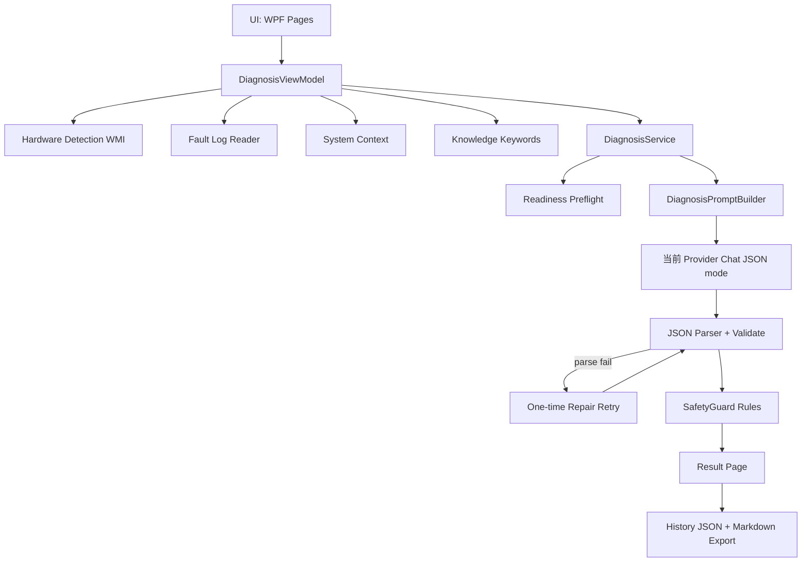

# AIGeekTuner

基于 .NET 8 WPF 与统一 AI Provider Runtime 的 AI 硬件故障诊断工具。

导入故障日志，结合本机真实硬件信息，由当前 AI Provider 生成结构化诊断结论；硬件采集、历史存储与 SafetyGuard 在本机完成，云端 Provider 会接收所配置的诊断上下文。

## Features

- 硬件信息采集（CPU / GPU / 内存 / 磁盘 / 操作系统，基于 WMI）
- 实时传感器读取（温度 / 功耗 / 频率，基于 LibreHardwareMonitor，可选能力）
- 故障日志导入（.txt / .log，UTF-8 / UTF-16 / GB18030 自动识别）
- 统一 AI Provider 结构化诊断（Ollama、LM Studio、llama.cpp、DeepSeek 及 OpenAI 兼容服务；JSON mode + 解析校验 + 一次自动修复）
- SafetyGuard 安全复核（危险电压 / 危险操作 / 过度自信拦截）
- 证据分层展示（事实 Fact 与推测 Inference 分开）
- 设置持久化（服务地址 / 模型 / 超时 / 输入上限等，保存后立即生效）
- 历史记录（成功与失败均留痕：模型、耗时、失败原因）+ Markdown 报告导出
- Provider 中立：诊断使用当前配置的 AI Provider；硬件采集、SafetyGuard 与历史记录始终在本机完成

## Architecture



## Reliability & Safety

### Anti-hallucination

Prompt 明确要求：AI 只能引用本次 source block 中的日志、用户描述或真实采集硬件字段作为“事实”，并提供可逐字符校验的 `sourceId` / `sourceQuote`；禁止编造未采集的温度、电压、功耗、BIOS、超频状态；推测必须标注为 Inference 并给出验证建议；证据不足时输出固定句式并降低 confidence。

### Structured Output

- 强类型 DiagnosticResult schema + 必填字段 / 枚举 / confidence 范围校验
- Fact grounding：sourceId 必须来自本次请求，sourceQuote 必须是对应 source 的逐字符子串
- 当前 Provider 的结构化 JSON 模式（Ollama 原生或 OpenAI 兼容协议）
- 平衡扫描器从模型输出中提取首个合法 JSON 对象（容忍 code fence / 前后噪声 / think 标签）
- 解析或 grounding 校验失败自动发起最多一次 repair 重试，携带简短结构化错误反馈

### SafetyGuard

本地规则层对 AI 结论复核：

- 异常电压建议（如 >1.70V）→ 拦截
- 禁用保护机制 / 绕过安全限制类建议 → 拦截
- 低置信度 + 绝对化措辞 → 警告展示

### Failure handling

Provider 未启动或模型缺失、请求超时、AI 输出/grounding 无效、settings.json / records.json 损坏——全部有明确的用户提示与自愈策略，不会崩溃或永久不可用。

## Optional Telemetry Sources (V2-M1)

AIGeekTuner 可读取可用的外部硬件监控数据，并保留数据来源；外部软件为可选项，未安装时内置传感器功能完全正常。

| 来源 | 方式 | 说明 |
| --- | --- | --- |
| LibreHardwareMonitor | 内置 | 默认来源，无需额外安装 |
| AIDA64 | WMI（Root\WMI\AIDA64_SensorValues） | 可选；需在 AIDA64 External Applications 中启用 |
| HWiNFO | Shared Memory（7.0+ SM2 接口，官方已完全公开） | 可选；需用户安装 HWiNFO 并启用 Shared Memory Support。免费版连续共享约 12 小时后自动停用、需手动重开；AIGeekTuner 不捆绑 HWiNFO，也不会以任何方式规避该时限 |

- AIDA64 / HWiNFO 需用户自行安装、启动并启用数据导出；AIGeekTuner 不捆绑、不下载、不自动修改它们的设置。
- 同一物理设备的识别基于证据（强 ID / 单例 / 归一化名称唯一匹配）；证据不足的设备保留来源本地身份，不做跨源回退。
- 同一指标按固定优先级（HWiNFO → AIDA64 → LibreHardwareMonitor）选择单一来源，不做多源平均，并保留来源溯源。
- Hardware 页与 Settings 页可查看各数据源状态。

## Diagnostic Recording (V2-M2)

手动录制硬件遥测会话：点击开始后按固定周期采集统一遥测快照，停止时生成本地确定性分析。

- 可配置采样间隔：1 / 2（默认）/ 5 秒
- 只记录 canonical 核心指标与多设备实例，保留来源溯源（含 HWiNFO→AIDA64→LibreHardwareMonitor 的来源切换）
- 统计：Min / Avg / Max / P50 / P95 / P99 与覆盖率
- 关键变化事件（温度 ≥5°C、利用率 ≥30pp、频率/功耗相对+绝对阈值、CPU throttling、来源切换、采样缺口）
- 本地存储于 `Sessions/{id}/session.json`（原子写入）

## Tests

运行：

```bash
dotnet test
```

自动化测试覆盖：JSON Parser、Prompt/source 构建、Diagnosis grounding 与一次 repair、SafetyGuard 规则、Provider runtime 与 JSON mode、设置持久化、运行时快照隔离、FileReader 编码、History 存储与损坏恢复、页面构造冒烟，以及 V2-M1 遥测域 / 单位归一 / AIDA64 映射与 Provider 状态机 / TelemetryHub 优先级回退。未声明覆盖率指标。

## Quick Start

### Requirements

- Windows 10 / 11
- 已在设置中配置并激活可用的 AI Provider（使用 Ollama 时需安装并运行 [Ollama](https://ollama.com)）
- 使用 Ollama 时推荐模型：`ollama pull qwen3:8b`
- .NET 8 Desktop Runtime（仅 framework-dependent 发布产物需要）

### 从源码运行

```bash
git clone <repo>
cd AIGeekTuner
dotnet run --project AIGeekTuner/AIGeekTuner.csproj
```

### 发布产物

发布与演示说明见 [docs/DEMO.md](docs/DEMO.md)。

## Privacy

硬件采集、日志读取、SafetyGuard 与历史记录在本机完成。AI 推理请求按“当前使用”的 Provider 发送：使用本地 Provider 时可保持本地处理；使用云端 Provider 时，诊断上下文将发送至该 Provider，并按其凭据与隐私政策处理。

## Limitations

- 当前支持 Ollama Native 与 OpenAI Compatible Provider（可配置 LM Studio、llama.cpp、DeepSeek 等服务）
- 诊断建议为辅助参考，不替代专业硬件维修
- WMI / LibreHardwareMonitor 的部分字段取决于硬件、驱动与管理员权限，读不到就以“未检测到”呈现，不会伪造
- 不执行任何 BIOS / 超频 / 电压修改操作
- 不解析 Minidump 二进制文件
- AI 可能判断错误：请结合 confidence、事实与推测分区自行判断
- V2 后续模块（Recorder / PresentMon 会话 / 语音总结等）尚未实现
